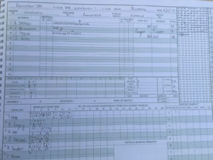

On a green wicket Wherwell won the toss and elected to bowl. S Taylor and O Emslie started the proceedings but found no assistance early on, however the first change H Trebert struck early on removing the Rowledge opener with an inswinger. N Young joined in the party and ripped apart the Rowledge batting line up. S Taylor and O Emslie came back on cleaned up the tail ending the Rowledge innings on 111 all-out. S Taylor & N Young took 3 wickets each, H Trebert and O Emslie shared the rest.

Wherwell opened up with R Skeates and C Beckingham. C Beckingham started strong hitting 2 fours in the second over. But unfortunately, he lost his wicket for 9 to a full toss by T Watt leaving Wherwell 12 for 1. S Taylor came in next and alongside R Skeates took Wherwell to the finish line within 18 overs. S Taylor 49 not out and R Skeates 52 not out.  Highlight of the innings was the stroke-play displayed by both batsmen, especially R Skeates who hit 4 boundaries off one over as he established his dominance over the Rowledge bowlers.

\[caption id="attachment\_18475" align="aligncenter" width="300"\] Innings of Wherwell\[/caption\]

Rowledge III did not fill out Wherwell's score book
