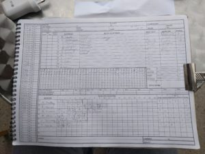
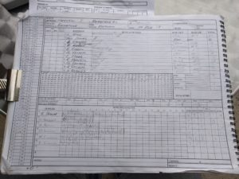

Another W for Wherwell

Wherwell continue their great start to the season with another successful chase.

Wherwell won the toss and put Basingstoke into bat. Wherwell bowled well and limited Basingstoke to 153 off 40 overs with L Norse top scoringWherwell continue their great start to the season with another successful chase. with 37. Oliver Emslie finished top wicket taker with 3-31, Mark Pettman and Matt Guilfoyle returning from their premature retirements took 2 wickets each, Stuart Taylor and Alex Gladwyn shared the rest.

Chasing 154 to win, Wherwell batted well, Matt Guilfoyle finished things off with 3 consecutive boundaries in the 38th over. John Foster and Alex Gladwyn chipped in with some invaluable runs. This performance takes Wherwell to 4th in the table.

\[caption id="attachment\_18492" align="aligncenter" width="300"\] Innings of Wherwell\[/caption\]

\[caption id="attachment\_18493" align="aligncenter" width="300"\] Innings of Basingstoke & NH IV\[/caption\]
