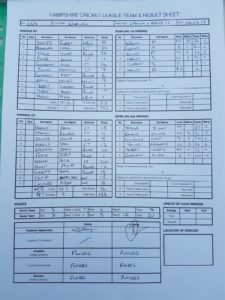

Wherwell and Liphook & Ripsley II played at Wherwell for an incredibly close game of cricket.

Wherwell lost the toss and were put to bat against a strong bowling and fielding attack. A wonderful crisp wicket also gave an interesting strip for Wherwell. An unnamed Wherwell player gave a rapid trigger finger making R Skeates LBW early on. The attack by the away team continuously tested Wherwell making S Taylor the top scorer with just 26. Excellent bowling performances by Liphook & Ripsley II toppled Wherwell's batting, D Elliot 10o 22r 3w, D Wrenn 10o 36r 2w and A Grimes 8o 30r 2w. Wherwell's new stumps were truly knocked in. Wherwell were all out for 132 off 41.3o.

Clear blue and sun shining, Wherwell had not given up. Show no love and Wherwell went out to attack the field with high energy and were determined to give Liphook & Ripsley II a fight. Textbook catches win matches as J Trebert demonstrated. Liphook & Ripsley II's game was starting to look different as Wherwell's N Young 10o 24r 4w, S Taylor 10o 37r 2w, O Emslie 10o 21r 2w and M Guilfoyle 9o 24r 1w. Wherwell had them on the back foot throughout the innings and gave them the away team a fight, but 133 was chased off 42.3o for 9w.

