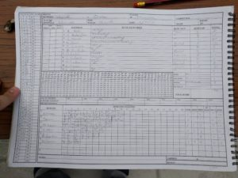
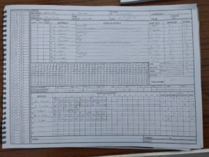

Skipper S Taylor won the toss and elected to bowl first with plans to kick start the season with a strong bowling attack. A relatively green wicket, sunny overcast and some strong winds.

Things were looking steady for both sides averaging just under 4/over by the 9th when Overton's opener was caught behind by N Young's exceptional lack-of-spin offspin delivery. 6 overs later their #3 was caught by O Emslie off H Trebert. Things were looking brighter as it was an innings of catches for Wherwell at 96 for 4 off 22. Overton's #2 - A Galvin - raised the game for Overton with a knock for 78 caught by R Skeates off O Emslie. Two quick wickets for Wherwell started to change the picture at 164 for 7 off 33, but a good performance by Overton's middle order - R Brown - tested Wherwell even further with a knock of 76no.

Overton finished their innings 251 for 8. Key bowling perforamnce for Wherwell: N Young 36 for 2 off 10 and O Emslie 49 for 2 off 10.

Wherwell faced a challenging start to their season going out to bat. R Skeates (8) left the square after 6overs, however this enabled S Taylor with a quick fire 35 before unfortunately being caught. C Beckingham (16) was also caught but Wherwell still had a promising middle order. N Young started his season well with an excellent knock for 50 and put Wherwell in a much better position. Overton's fielding attack proven tough on Wherwell as O Emslie (15) was close but no cigar ran out while the rest of the batting order seemed to fall through.

Overton were kept out to field for 43 overs until Wherwell were all out for 174.

\[caption id="attachment\_18446" align="aligncenter" width="300"\] Innings of Wherwell\[/caption\]

\[caption id="attachment\_18447" align="aligncenter" width="300"\] Innings of Overton\[/caption\]
