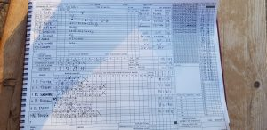

KJM sponsored Wherwell CC traveled to Medstead for a must win game to keep promotion hopes alive. Skipper R Skeates finally won the toss and elected to bat first.

Wherwell started very brightly with the traditional C Beckingham 33 and R Skeates 15 duo. Unfortunately both were caught, a theme that all Wherwell batsman would follow. M Cutts 39 and O Emslie 24 saw through the majestic spin from Medstead on a popping track, but Wherwell top/middle order faltered until No.6 N Young took to the crease with a fresh 58no from his last innings. In good touch N Young set about the counter attack increasing the run rate, supported by J Trebert and A Cook. N Young rounded off with a great knock of 86no, finishing 237-8 in yet another day of cricket in blistering heat.

After a quick tea Wherwell took to the field. Openers J Foster 5o 26r 2w and H Trebert 9o 1m 38r 0w were tested in their first few overs but J 'heellooo' Foster (DoD) made the break through with a caught and bowled. O Emslie 8o 47r 0w and returning Wherwell star M Pettman 5o 1m 15r 0w bowled well as first changes but with little reward as Medstead started to knuckle down and chasing well with 92 off 21 for 2. N Young 9o 1m 27r 3w clearly not tired enough took a key wicket, taking the opportunity to foil Medstead's run rate and middle order. R Skeates replied with his own majestic ball-fizzing spin 8.5o 1m 34r 1w. A Gladwyn rocketed a casual colin run out as Wherwell gained full control of the game and restricted Medstead to 202-7 after 45 overs.

Wherwell now 3rd in the league need to win all 3 games to secure 3rd place with outside chance of second. #upthewherwell

