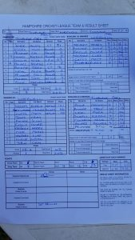

[The KJM Group Ltd](https://www.kjmgroup.co.uk/) sponsored Wherwell CC traveled to Tichborne Park looking to make it three wins out of the first three games.

Captain Robbie Skeates is yet to win the toss this season and was put out to field. Harry Trebert 9o 18r 2w and John Foster 9o 33r 2w got the ball rolling picking up quick early wickets bowling very well. Chances went against H Trebert with unfortunate luck against a strong partnership built up by the home team which tested Wherwell's patience in the sun - Tichborne's opener A Joyce scored 81 and N Connel 69. Ollie Emslie 9o 42r 3w and Matt Cutts 7o 31r 2w persevered and tied up the innings finishing 45 overs 200-9.

Craig Beckingham started his season with a bang hitting a very well made 46. Other opener R Skeates got his 3rd century for Wherwell with 101\*. A selfless 10\* from number 3 M Cutts saw the victory for Wherwell in 28.4 overs making it a convincing 9 wicket win, who look to make it four for four away to Donnington next week.

\[caption id="attachment\_18783" align="aligncenter" width="169"\] Tichborne Park II v Wherwell 20180520 scoresheet\[/caption\]
