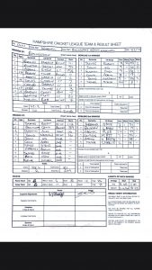

Wherwell hosted Basingstoke in the early start game. Both teams were massively struggling for players. 10 man Wherwell won the toss and decided to field in the heat. After a explosive start Wherwell managed to finally restrict the quick run rate with the introduction on N Youngs spin 4-36. Basingstoke managed to reach 206 all out from 43 overs. A massive effort from Wherwell was required. Beckingham and Skeates went about the task with ease scoring at 6 an over in the early stages. Beckingham soon fell playing a loose shot, Skeates however went on and scored an impressive 117 not out as Wherwell cruised to an 8 wicket victory.

\[caption id="attachment\_18855" align="aligncenter" width="169"\] Wherwell v Basingstoke & NH IV scoresheet\[/caption\]
