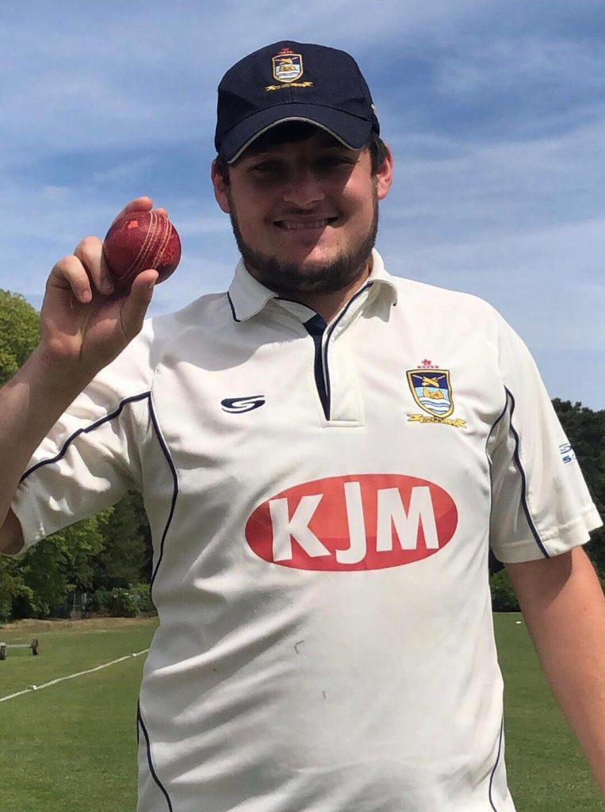

KJM sponsored Wherwell CC travelled to Basingstoke and North Hants IV.

Basingstoke won the toss and elected to bat on a scorching day.   
An amazing Wherwell bowling display ensured that Basingstoke were bowled out for 100 runs in 22 over. H Trebert started of the proceedings with a wicket off the 1st and 3rd ball of the innings. Opening bowlers H Trebert and O Emslie took 9 wickets between them to decimate the Basingstoke batting line up in 18 overs. Only resistance coming from R Simpson 20 runs and R Norwell 26 runs. H Trebert was the toast of Wherwell with career best 6 -30. O Emslie carried on his good from with 3-39, S Turner 1-14 chipped with the final wicket.

Basingstoke & NH IV v Wherwell (away, 01/06/2019) - H Trebert 9o 30r 6w

Wherwell’s batting made short work of the target chasing the runs 102 for 2 in 20.1 overs. Skipper R Skeates made a quick fire 30. M Cutts on the back of last weeks hundred scored 32 runs not out with O Emslie 15 runs not out taking Wherwell home for the loss of 2 wickets. 

Strong result takes Wherwell to 5th in the table. Wherwell welcome Hursley Park III at home next weekend.

Basingstoke & NH IV v Wherwell (away, 01/06/2019)

Basingstoke & NH IV v Wherwell (away, 01/06/2019) - innings of Wherwell CC

Basingstoke & NH IV v Wherwell (away, 01/06/2019) - innings of Basingstoke & NH IV
