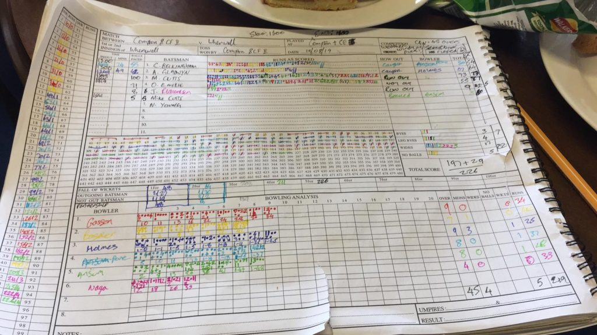

Wherwell make it 8 wins in a row!

KJM Sponsored Wherwell travelled away to Compton and Chandlers Ford II. Under overcast skies and strong winds, Wherwell lost the toss and were put into bat on a green track.

Wherwell openers started off strongly, finding runs easy to come by. Alex Gladwyn was the first to go with an attractive 27 runs. Fellow Opener Craig Beckingham was out soon after for 30 runs, leaving Wherwell 68-2. Matt Cutts was joined at the crease by Oliver Emslie. Matt Cutts set the tempo while O Emslie set about the anchor role. They put together a 139 run partnership. Matt Cutts was run out for 73 runs. The highlight of the innings being a huge Six into the nearby children’s playpen. O Emslie carried on his knock and took Wherwell to 226-5. O Emslie remained 55\* not out. T Holmes was the pick of the bowlers 9o 3m 1w 25runs.

Wherwell knew batting would be easier in the Compton innings as the sun had come out and the outfield was beginning to dry. Wherwell started off well with an early wicket and bowling tight lines. Mike Cutts and Nathan Young bowled a great first spell limiting Compton’s run rate. Matt Guilfoyle returning from his early retirement took the second wicket early in his spell, sending D Bhatnagar back for 16. Compton consolidated their innings, batting watchfully until N Young got wherwell’s 3rd breakthrough in the 29th over, removing D Wareham for 33. Wherwell strangled the Compton run rate bowling the right lines, while also taking wickets at regular intervals. J Richardson bowled superbly and along with O Emslie finished Compton’s innings for 150 all out. J Richardson took 3 wickets. Mike Cutts, O Emslie and M Guilfoyle took 2 wickets each, while N Young took 1 wicket. Standing Skipper Emslie bowled an amazing 6 maidens in his 8.2 overs. Wherwell were also electric in the field, ensuring pressure was alway in Compton.

This result leaves Wherwell 2nd in the league. Wherwell are home to Old Basing II next weekend.

Compton & Chandlers Ford II v Wherwell (away, 10/08/2019) - Scorebook - innings of Compton & Chandlers Ford II

Compton & Chandlers Ford II v Wherwell (away, 10/08/2019) - Scorebook - innings of Wherwell
