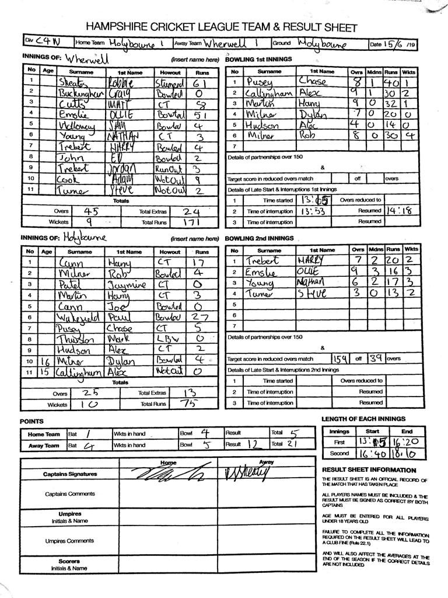

KJM sponsored Wherwell away at Holybourne. Under overcast conditions Holybourne won the toss and decided to bowl.

In a stop start innings due to the rain, Wherwell started off poorly losing 2 wickets quickly. R Skeates 61 and O Emslie 51 patiently built the innings with a 100+ run partnership. The lower order failed to convert the strong position provided by R Skeates and O Emslie. Wherwell ended on 171. R Milner was pick of the bowlers for Holybourne, he took 4 wickets.

Due to Duckworth Lewis shenanigans, a revised target of 159 in 39 overs was set. Opening bowlers O Emslie and H Trebert started well and took the Holybourne batsmen to task. Within no time Holybourne were 5 wickets down. N Young and S Turner finished off the innings for 75 runs in 25 overs. H Trebert 2-20, O Emslie 3-16, N Young 3-17 and S Turner 2-13. A top display by the bowlers to defend the total. They were backed brilliantly by the team, ensuring constant pressure on the opposition. A rare highlight for an outfield fielder with R Skeates taking a hat trick of catches.

Wherwell are at home to Hook & Newnham Basics IV’s next week.

