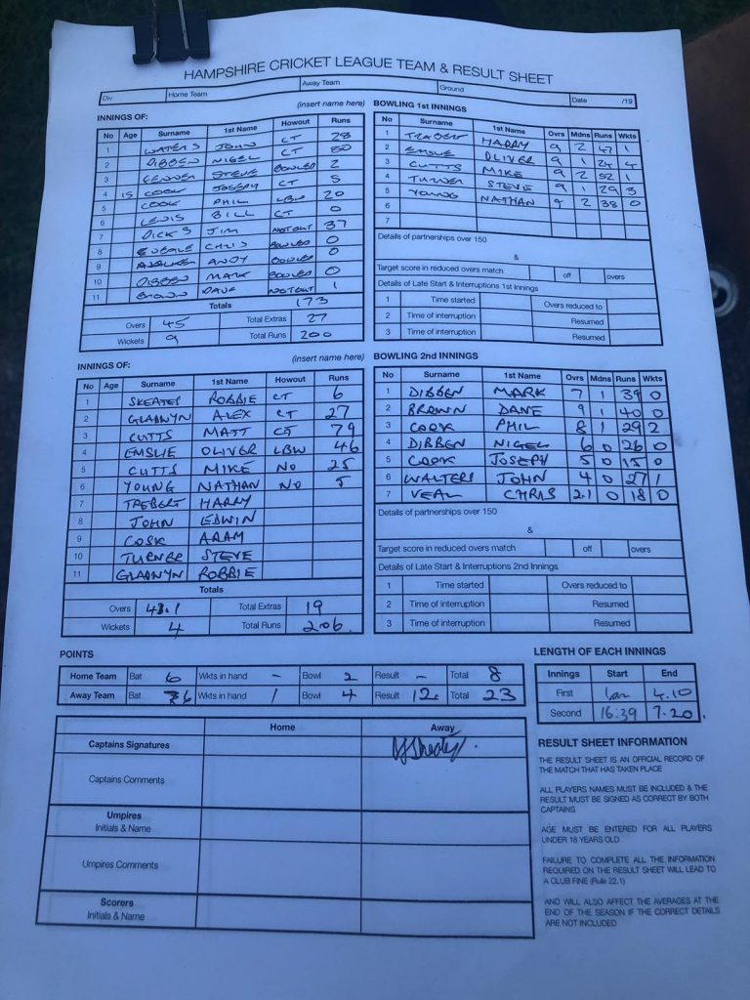

KJM Sponsored Wherwell travelled to Littleton & West Hill. Wherwell lost the toss were put to bowl.

Wherwell started superbly, building constant pressure by keeping the run rate down. After the drinks break Steve Turner returning from his stag, broke the opening stand and took 3 quick wickets. Wherwell kept Littleton’s scoring in check, taking wickets at regular stages. Only resistance coming from Nigel Dibben 80 runs and Jim Dicks 37runs. Oliver Emslie returning for his second spell ripped through the Littleton lower order ending Littleton’s innings on 200-9. Oliver Emslie took 4 wickets for 24 runs in 9 overs.

In reply Wherwell openers looked to take the attack to Littleton, Alex Gladwyn scored a quick 27. After both openers fell for less than 50 runs, Matt Cutts and Oliver Emslie built a 100+ run partnership, before O Emslie was lbw for 46 runs. Matt Cutts then looked to finish the game off but was caught behind for 79 runs continuing his good start to the season. Mike Cutts with a quick score of 25, finished the game off with multiple 6’s.

Result leaves Wherwell 3rd in the league. Wherwell welcome Alton III next weekend.

Littleton & West Hill v Wherwell (away, 29/06/2019) - scoresheet
