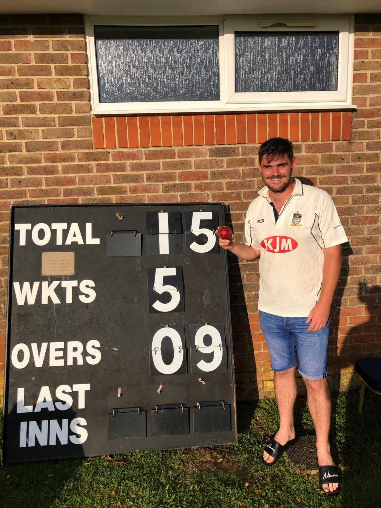
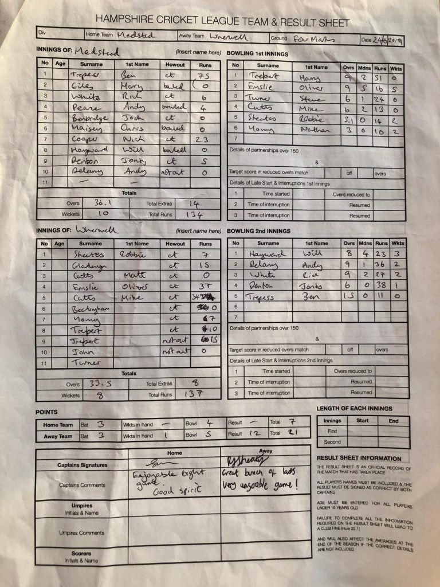

Wherwell gain promotion after 10 wins in a row.

KJM sponsored Wherwell CC travelled away to Medstead. Medstead won the toss and elected to bat.

Knowing promotion was in reach, Wherwell started well with Oliver Emslie removing opener Harry Goles for a duck in the 2nd over. This was an omen of things to come, as O Emslie took hold of the Meadstead innings taking his maiden 5 haul. O Emslie bowled his 9 over spell with great skill and vigor constantly getting batters in trouble playing and missing. Wherwell strangled the run rate bowling the right lines and taking wickets at a regular intervals. Nathan Young came into the attack and removed a budding partnership in his first over. Only resistance Wherwell felt was Medstead captain Ben Trepess played a wonderful innings of 75 runs, before Robert Skeates came into the attack and removed his counterpart. Medstead were bowled out for 134 runs in 36 overs. O Emslie finished on 9o 5w 16runs. N Young and R Skeates took 2 wickets each.

Wherwell in reply started poorly losing R Skeates and Matt Cutts in the same over, leaving Wherwell 8 for 2. O Emslie and opener Alex Gladwyn steadied the ship, before A Gladwyn was caught for 15 runs. Mike Cutts came in next and played a adventurous knock of 34 before he was caught on the boundary looking for conservative 6’s. O Emslie could only watch as Wherwell lost a slew of wickets without adding many more runs to the score card. O Emslie’s vigil ended when he was caught out on 37 runs. Leaving Wherwell 20+ runs and 3 wickets in hand. In the nervy final moments, Harry Trebert was caught out for 10 runs looking for the winning runs. Jordan Trebert hit the winnings runs off the next over with a trademark sweep. Wherwell’s final score was 137 for 8. Will Hayward was the pick of the bowlers for Medstead he bowled 8o 3w 23 runs. A tense finale to the game highlighted the team spirit at Wherwell.

This result means Wherwell has gained promotion from the league and remain 2nd with a slim chance of winning the league. Wherwell are home this weekend to Ampfield.

O Emslie 9o 5m 16r 5w

Medstead v Wherwell (away, 24/08/2019) - scoresheet
