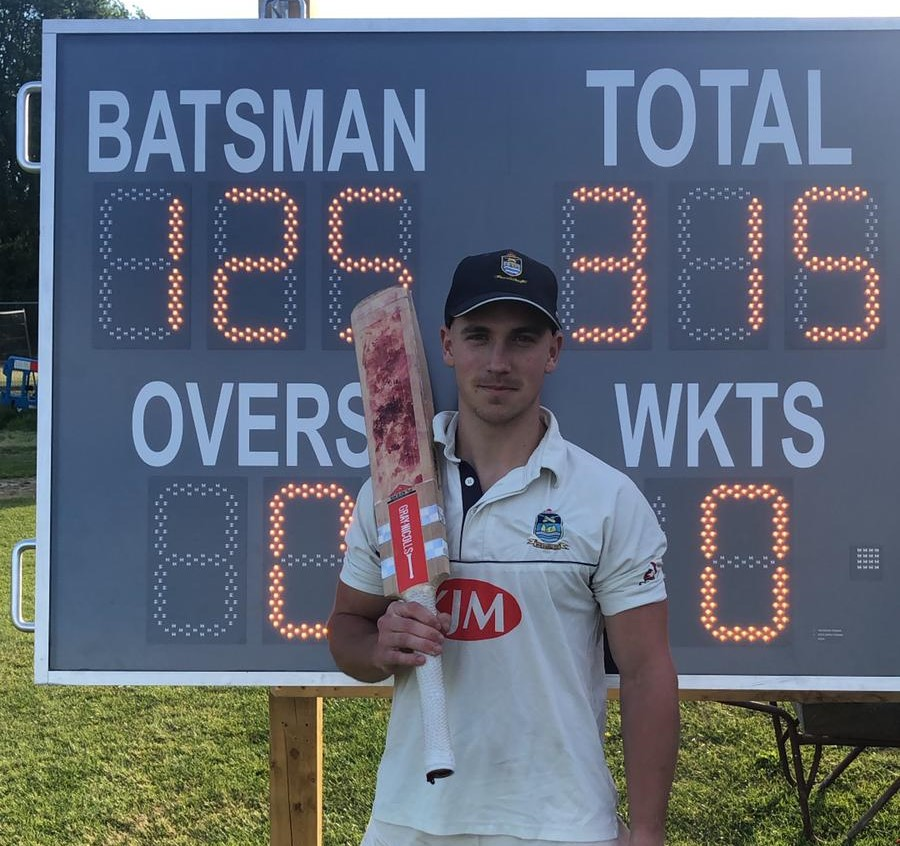
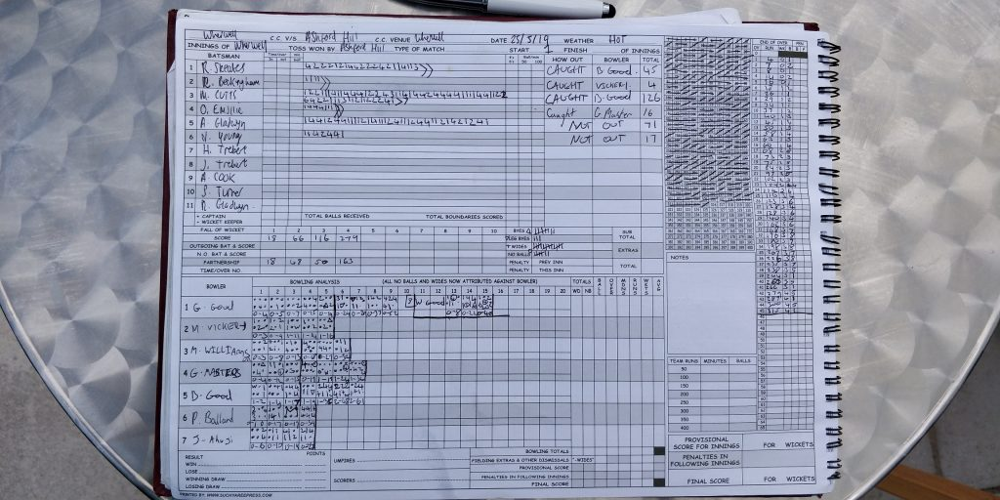
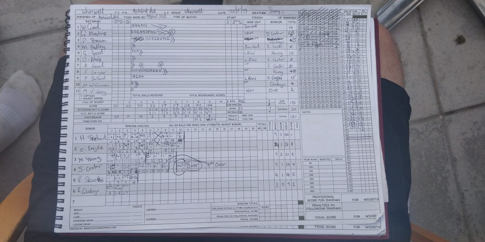

KJM Group Ltd sponsored Wherwell CC lost the toss and were put out to bat. Skipper R Skeates set the standard early on with an excellent knock of 45, looking in promising form for the season. M (Bigger) Cutts was the man of the show by scoring an outstanding 126 and hitting over a 150 partnership with A Gladwyn (71\*). Wherwell finished off their innings scoring 315 losing just 4 wickets.

Wherwell CC v Ashford Hill (home, 25/05/2019) - M Cutts 126

Ashford Hill had such a tall order to meet but another kind of gravy held them back when Wherwell went out to bowl. S Turner bottled a fiver finishing on 9o 34r 4w. Yet another outstanding stint by N Young 9o 21r 3w starting the season well. Unstoppable R Gladwyn 3o 9r 2w gave us the needed break through for the stubborn stragglers as Wherwell finished off winning by 164. Wherwell look to keep going from strength to strength next week away to Basingstoke & NH IV.

Wherwell CC v Ashford Hill (home, 25/05/2019) - Innings of Wherwell

Wherwell CC v Ashford Hill (home, 25/05/2019) - Innings of Ashford Hill
