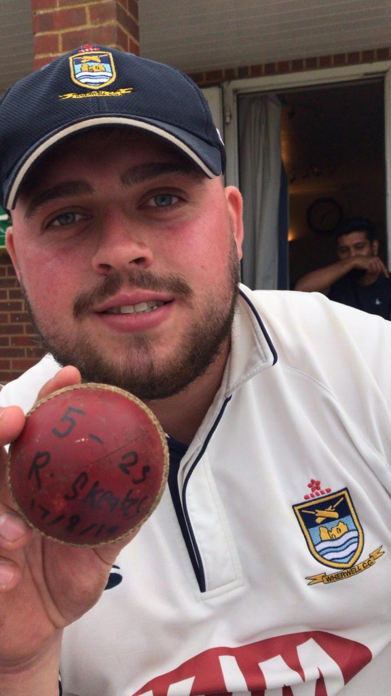
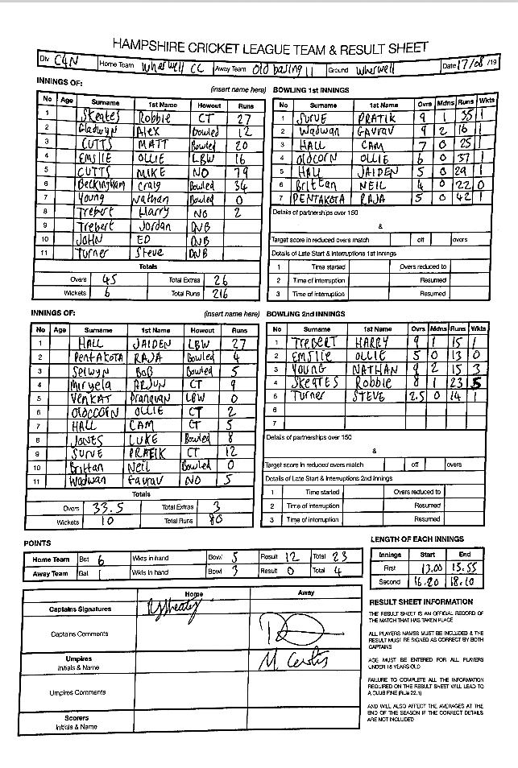

Wherwell make it 9 wins in a row.

KJM sponsored promotion chasing Wherwell at home to Old Basing II.

Wherwell lost the toss and were put into bat on a slow surface. Wherwell openers played watchfully, seeing off the new ball. Old Basing struck in the 10th over sending back Alex Gladwyn for 12. Skipper Robbie Skeates was out caught behind on a good looking 27. The dependable Matt Cutts and Ollie Emslie were brought together but unfortunately both were dismissed soon after, leaving Wherwell 88-4 in 28 overs and in trouble. Mike Cutts and Craig Beckingham came togetherness and knew they had to up the run rate. They put together a 100+ run partnership, before C Beckingham was bowled for 34 looking for a bit hit. Mike Cutts 79 not out powered Wherwell to a total of 216-6. G Wadwan was the pick of the bowlers 1-16 in 9 overs.

On a raging turner that could be a stand in for day 5 in Mumbai. Wherwell bowlers started strong keeping the old Basing run rate down. The spinners Nathan Young and R Skeates took hold of the game and immediately made dents into the old Basing batting quickly taking wickets and keeping the run rate down. N Young took 3 wickets. R Skeates took his maiden 5 wickets haul foxing the Old Basing batting line up. Wherwell cruised to the win. Bowling out Old Basing for 80 runs in 33.5 overs. Steve Turner and Harry Trebert took 1 wicket each. Only resistance coming from J Hall 27 runs. N Young 9o 2m 15runs 3w. R Skeates 8o 1m 23runs 5w.

Result leaves Wherwell in 2nd, closing in on promotion. Wherwell are away to Meadsted next weekend.

R Skeates 8o 1m 23r 5w

Wherwell v Old Basing (home, 17/08/2019) - scoresheet
