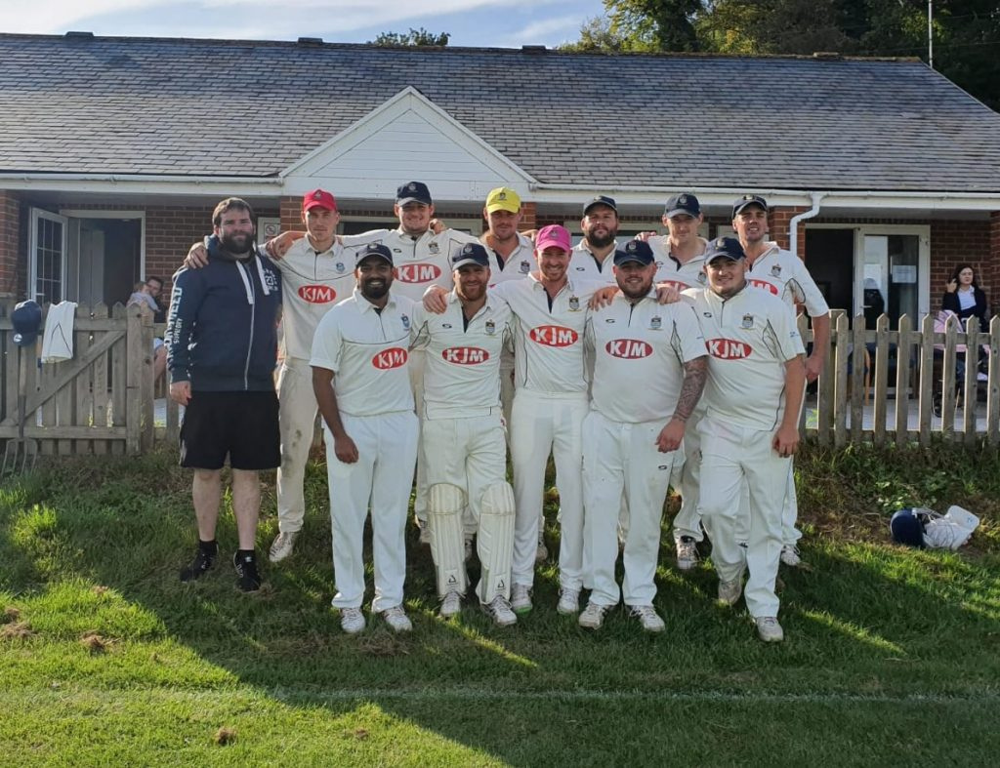
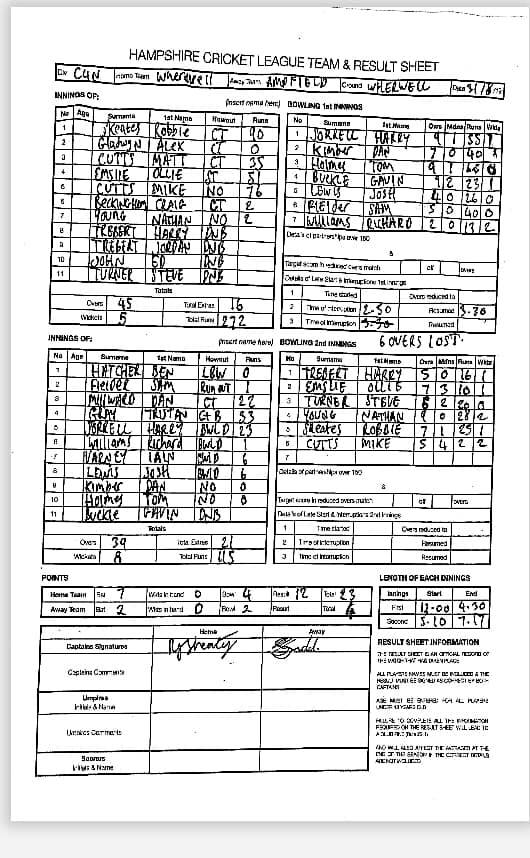

Wherwell win County Division 4 North.

KJM sponsored Wherwell for a the final time this season at home to Ampfield. Skipper Robbie Skeates won his first toss in 7 games and decided to bat first, looking to make 11 wins in a row.

With only a slim chance at the league title Wherwell knew they had to be at their best, get maximum points and hope other results go their way. Ampfield struck on the 2nd ball of the innings removing Alex Gladwyn. Robbie Skeates and Matt Cutts took the attack to Ampfield and put on a strong partnership before Matt Cutts was caught out for 35 runs. Ollie Emslie came to the crease and built a solid partnership with Skeates. Emslie scored another half century before being stumped for 51 runs. Mike Cutts carried on his good form, and began dispatching the Ampfield attack. Skeates playing the anchor innings kept things moving while Mike Cutts was bludgeoning the bowlers. Skeates looking to up the ante was caught out for 90 runs. Big hitting by Mike Cutts meant Wherwell ended on a mammoth 272-5. Gavin Buckle was the pick of the bowlers ending on 1-23 in 9 overs.

Wherwell started strong, with Harry Trebert removing Ben Hatcher for 0 in the first over. With the run rate being kept low by the Wherwell opening bowlers, with pressure showing, Ampfield’s Sam Filder was run out for 1 by Nathan Young. Ampfield showed a bit of resistance with Dan Milward and Trutan Gray who blocked out until the 16th over, before N Young removed Milward for 22. Skeates then caught and bowled Gray for 33. Harry Jorrell showed some urgency with some big hits before being bowled by N Young for 23. With 5 wickets left and 10 overs go, Mike Cutts bowled Richard Williams of his first ball, then Ampfield batters frustrated Wherwell by playing and missing countless balls. Emslie took another wicket with a Jaffa. Mike Cutts got another breakthrough, leaving Ampfield 8 down and 3 overs to go. However Ampfield managed to frustrate Wherwell to see out their innings at 115-8. Mike Cutts the pick of the bowlers with. 2-2 in 5. N Young took 2 wickets, Emslie, Trebert and Skeates took the other wickets.

Wherwell finished the game with 23 points and as they were celebrating promotion, news came in that Chawton had lost against Alton and ended their season on 19.92 average points. This meant Wherwell had won the league, by averaging 20.56 points this season.

This was a fitting end to a wonderful season for Wherwell. Wherwell will be in County 3 North next season.

[#UTFWCC](https://twitter.com/search?q=%23UTFWCC)

Wherwell v Ampfield & North B (home, 31/08/2019) - scoresheet
