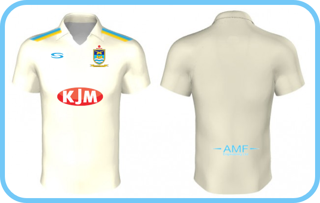

Wherwell are proud to have secured a new sponsor [AMF Engineering](https://amf-engineering.co.uk/). We are also happy to announce another renewal with long-term sponsor [KJM](https://www.kjmgroup.co.uk/).

In light of our new sponsorship deals, we are kitting out all our members with brand new kit ready for the 2020 season!

Over the last few seasons Wherwell have come from strength to strength. Last year's performance secured us a spot in the Division 3 North and we're looking forward to new challenges ahead.

Wherwell have also been taking part in the [Serious Cricket Indoor League for 2019-2020](https://seriouscricket.co.uk/cricket-centre/indoor-league/tables/sc-indoor-league-20192020/). As it stands we're currently top of the table; played 11 lost 2. 6 games are left and 6 wins are needed.

Without these sponsorship deals, secured by club lifer Nathan Young, and all involved at Wherwell CC, we wouldn't be where we are today. We are in high spirits for the 2020 season. With the right people behind the club and sponsorship deals secured, we can continue investing in our members and facilities.

We encourage anyone thinking of getting involved in cricket this summer to join us. We offer fantastic facilities, an excellent group of people with great socials and good opportunities to play cricket.
