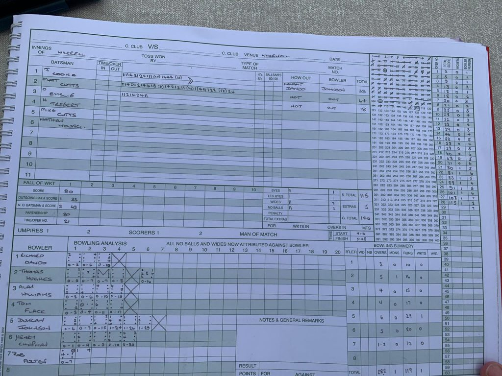
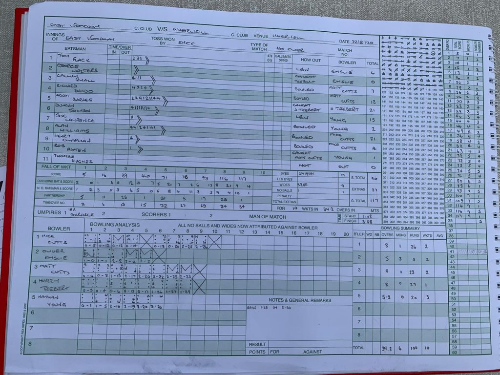

A lump of coal is turned into a diamond with relentless pressure, and that’s exactly what Wherwell exerted against East Woodhay. Top bowling and tight fielding giving very little opportunity.

However it started with a gift, a loopy full toss loosener from Emslie’s first ball was miscued to midwicket, the apology offered probably didn’t make the batsman feel any better. Emslie struck again finding some seam movement and both openers were gone early before a short rain break came.

Having taken two wickets for just two runs off five overs Emslie though it was best to take himself off allowing Matt Cutts and Harry Trebert to continue the attack. Matt found a length and some nip to knock over two and with tight overs both ends Harry induced a false shot. Young found some turn and Mike Cutts some pace to clear up the tail which threatened to wag but only briefly before being snuffed out for total of 117ao.

Plenty of chat about the pitch so Wherwell set about the chase in a patient and controlled manner. Every run was sacred but Matt Cutts and Cooke just kept chipping away.

As runs began to flow a bit more freely Cooke gave East Woodhay an opening but with the score already at 80 the door wasn’t open for long. Matt Cutts completed his 50 with a thumping drive through the covers with he and Emslie safely steering Wherwell to another successful chase and a 9 wicket victory.

Wherwell v East Woodhay (home, 22082020) - Innings of Wherwell

Wherwell v East Woodhay (home, 22082020) - Innings of East Woodhay
