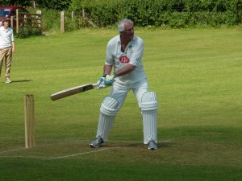

With most league cricket finished for the season it was a pleasing mix of youth and experience that formed the KJM sponsored Wherwell team that visited Winterbourne. The home side had already won the division and with their 1st XI also confirmed champions of their division both sides had some big guns on display.

Wherwell lost the toss and was invited to bowl, with Harry Trebert (2 for 38) taking the new ball in partnership with Christian Nicel (1 for 21 from 8)youth and experience were head to head and to his credit youth struck first with Trebert getting the breakthrough thanks to a sharp Stuart Taylor catch, Nicel was once again the victim of dropped catches seeing 3 go down and finally resulted to full and straight to get his rewards. The change bowlers particularly Rory Griffin ( 2 for 25) strangled the home sides middle order with the growing consistency he has shown this season. The home side had struggled to drinks with 6 wickets down and only 90 on the board, the introduction of Taylor (4w for 6r) showed the difference in squad strength as he ripped through the tail and could have had a worthy hat-trick but for one of the 6 dropped catches and when Taylor picked up his third wicket with a comfortable return catch the home side were all out for 112.

With some excellent home made sponge cake nestling nicely in the stomach Mick Ling ( 29 no) opened the batting with Taylor who carried on with the bat where he had finished off with the ball. His first ball should have been his last but was dropped at square leg, they always say when you are dropped make them pay and he truly did! he raced through 30 before his partner was off the mark and proceeded to hit anything off line to the boundary. By the time he fell caught at slip for a sparkling 59 the score was 90 and the game effectively won. Nigel Horne( 15 n.o.) walked in at 3 off the back of his maiden half century and the fielders sensing a chance of a couple of quick wickets closed in, this though just meant they had to run further to pick the ball up a Horne unleashed some sumptuous cover drives to take the team to the brink of victory and fittingly it was Ling who hit the winning runs with a beautifully executed pull for 4 to complete a maximum points 9 wicket victory for the visitors.
