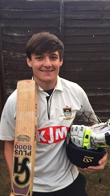

\[caption id="attachment\_18257" align="alignleft" width="180"\] Harry Trebert 145no vs Ashford Hill III 04/07/2015\[/caption\]

Wherwell 2nds traveled to Ashford Hill aiming to bounce back from a 6 run defeat last weekend. New captain for the day, Harry Trebert, won the toss and chose to bowl first. Wherwell got off to an impressive start with Nick Baughen by picking up the first wicket of the day for Wherwell, closely followed by Scott Blackmore who bowled a very good spell by getting 2 for 51 off his 10 overs. Ashford Hill started to pick up the pace towards the end of their innings finishing on what they thought was a very impressive 258 for 4.

Wherwells opening batsmen lost 3 wickets for only 33 runs which bought Harry Trebert and Giles Elwes to the crease with a lot of pressure to steady the innings. They both got off to a great start with Trebert picking up his very first half century, closely then followed by Elwes. Elwes (52) then got out leaving Trebert and Blackmore with more added pressure. Trebert then went on to scoring his first ever century and managed to win the game for Wherwell, ending on 145no.
