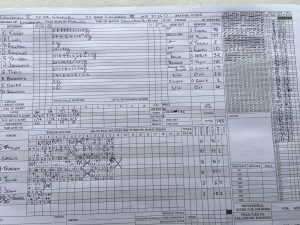

On an uneven wicket, Wherwell won the toss and put Longparish into bat. Wherwell started off well with the opening bowler’s S Taylor and O Emslie bowling disciplined line and length, only costing 26 runs in the first 10 overs. Wherwell got the first breakthrough in the 19th over when N Young bowled A Lister for 29 runs. H Trebert joined in the party with another breakthrough in the 22ndover to remove D Bearpark for 2, leaving Longparish 58 for 2. J Foster came into the attack and quickly removed J Blackmore for 10 and G Kousseff for 28, leaving Longparish 104 for 4 in the 32rd over. In came S Trinder, who took the attack to Wherwell. J Jackman also continued the scoring until S Taylor came back and removed him for 16. H Trinder’s stay was over when he was caught behind off O Emslie for 32. A slew of attacking intent meant that they ended their 45 overs at 193 for 8 leaving B Blackmore not out on 26 and A Samways for 4.

In reply Wherwell immediately lost their first wicket as opener C Beckingham was caught behind for a duck off C Clarke. But S Taylor and R Skeates took the Longparish bowlers to work, with Taylor getting another 50 in the process, highlight being two massive 6’s of S Trinder. S Taylor fell to an inswinger from J Blackmore for 54. In came B Smith, who carried on the scoring with R Skeates, who played a watchful innings until he was bowled for 49. Runs were frequent to come by, but so were the wickets, a flurry of wickets with total nearing ensured a nervy finish with N Horne taking Whewell home with two beautiful fours to lead Wherwell to a well-deserved win by one wicket.

\[caption id="attachment\_18471" align="aligncenter" width="300"\] Innings of Longparish II\[/caption\]

\[caption id="attachment\_18574" align="aligncenter" width="300"\] Longparish II v Wherwell (away, 27052017)\[/caption\]
