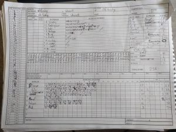
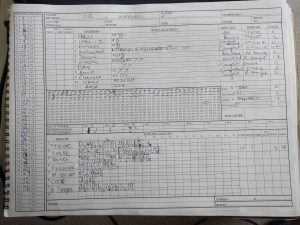

KJM Group Ltd sponsored Wherwell were away to Old Basing II for the last game of the season. Skipper S Taylor won the toss for the 2nd time this season and Wherwell elected to bat first.

The top order showed good composer with notable scores Stuart Taylor (81), putting Wherwell in a comfortable position cemented further by Alex Gladwyn’s (46) steady knock. Runs trickled through as wickets were slowly picked off by Old Basing II, walking off with 236 for 8.

Wherwell have not walked out to bowl this season with any doubts or lows – spirits as always were high to tie off the season positively. Wherwell kept Old Basing II on the backfoot throughout and kept the home team to a painfully low run rate. Notable performances S Taylor 9o 13r 2w, R Skeates 7o 23r 2w and Ollie Emslie 10o 18r 4w. Jug avoidance was not an issue with 5 catches.

Old Basing II stretched it out for Wherwell all the way reaching just 115 for 9. Wherwell won by 121 runs. Stuart Taylor finished his season scoring 749 runs.

\[caption id="attachment\_18569" align="aligncenter" width="300"\] Old Basing II v Wherwell (away, 26082017) - Innings of Wherwell\[/caption\]

\[caption id="attachment\_18570" align="aligncenter" width="300"\] Old Basing II v Wherwell (away, 26082017) - Innings of Old Basing II\[/caption\]
