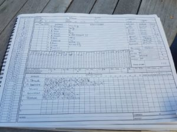

KJM sponsored Wherwell played at St Cross on a gloomy day and skipper S Taylor lost the toss again and was put out to bat on a mildly damp wicket.

Incredible performances by the top order kept Wherwell flying high gunning for promotion. R Skeates and G Elwes gave Wherwell the steady start they needed, but after 15o R Skeates had enough and started pummelling. Whippersnapper Elwes enabled the top order and handed the baton to S Taylor who quickly picked up 104 peaking the run rate above 10 at one point before being bowled but leaving his side in a strong position of 237 for 2 off 27. R Skeates continued the plough and scored 118 with a surprising amount of cardio. A Gladwyn (26), M Guilfoyle (3no) and N Young (1no) saw the away team through to finishing 302 for 4.

Clear blue skies for Wherwell going out to bowl and maximum points were wanted. O Emslie started St Cross IV’s topple with two stump flying wickets while the others followed in quick succession. S Taylor 8o 3w 18r, O Emslie 10o 2w 26r, M Guilfoyle 5o 2w 13r, H Trebert 6.3o 2w 19r and N Young 5o 1w 14r.

With yet another win under their belt during an incredible season of tremendous team work, Wherwell still need to fight and show no love for their final two games to be in for winning the league and/or promotion.

\[caption id="attachment\_18549" align="aligncenter" width="300"\] St Cross IV v Wherwell - Innings of St Cross IV\[/caption\]

\[caption id="attachment\_18550" align="aligncenter" width="300"\] St Cross IV v Wherwell - Innings of Wherwell\[/caption\]

\[caption id="attachment\_18551" align="aligncenter" width="225"\] St Cross IV v Wherwell - Scoresheet\[/caption\]
