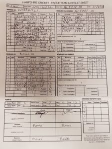

Wherwell played at home against Alton III's and skipper S Taylor lost the toss and was told to bat.

Wherwell's batting gave Alton a strong reply to their choice to bowl first. R Skeates (17, lbw), S Taylor (60, ct), R Chetwynd-Talbot (20, runout), O Emslie (31, bowled) and J Trebertt (17, not out). Alton III's gave 29 extras to Wherwell giving the home team a reasonable 201 to defend. M Guilfoyle was the only batsmen to not score runs.

The target to defend 201 rapidly turned into yet another strong fielding attack by Wherwell, with notable performances by H Trebert 5.4o 15r 3w, S Taylor 10o 32r 3w, R Chetwynd-Talbot 10o 21r. N Young and M Guilfoyle took a wicket each. M Guilfoyle took a catch like a salmon heading up stream. 

Alton III were all out for 124 giving Wherwell another win. Wherwell have shown no love in the field this year and continue to show their strengths as a team under pressure.

\[caption id="attachment\_18538" align="aligncenter" width="225"\] Wherwell v Alton III (home, 15/07/2017) scoresheet\[/caption\]
