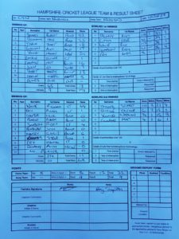

Stuart Taylor lost another toss and were put into bat on a two-paced wicket. The Wherwell batsmen definitely got their cardio workout due to the slow outfield. All the batsmen got starts however no one was able to fully capitalise on their start. Robbie Skeates top scored with 32 runs, Nathan Young scored 24 runs and Harry Trebert scored 23 runs. R Simpson took 4 wickets for Medstead to keep Wherwell's innings in check.

Wherwell's bowlers made easy work of the task at hand, bowling Medstead out for 68 runs in 27.4 overs. Richard White top scored with 48, however It would have been an even bigger margin had Robbie Skeates held onto a dolly at square leg when Richard White picked him out when he was on 7 runs. Highlight of the innings was the 4-wicket spell from Stuart Taylor. Nathan young took 3 wickets and the rest were shared between Oliver Emslie and Matt Guilfoyle.

