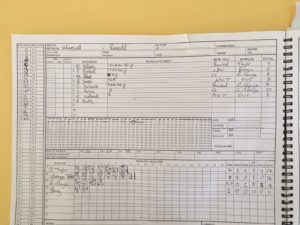
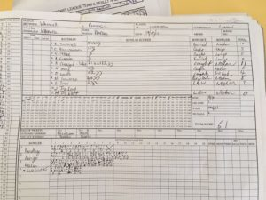
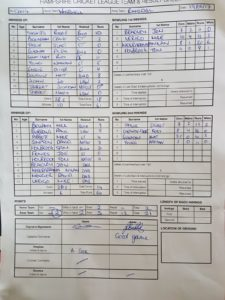

KJM sponsored Wherwell played at home against promotion rivals Ramsdell in a crucial match that would decide either teams’ chances of going up this season. S Taylor lost his 11th toss for the season and was put out to bat on a mildy damp wicket.

Ramsdell had an impressive bowling attack with a double wicket maiden in the 6th over having Wherwell on the back foot. R Skeates showed patience early on but wickets tumbled through Wherwell’s usually dominant batting order leaving R Chetwynd-Talbot top scorer with 11. Not much to be said other than great bowling and fielding performances by the away team.

Wherwell were all out for 61 off 28.

The home team were up for a quick turn around and were eager to take the challenge on. Show no love has been the motto all season and stunning performances of bowling and fielding had Ramsdell 32 for 4 off 17. N Young took a tremendous diving running backwards catch off M Guilfoyle off the batsman that was just saved by the jam pot. At this point Wherwell had quickly picked off their top order but as the wicket dried with the sun shining, it was a quick fire 21 by their middle order that settled their nerves and took them to victory. Notable performances are S Taylor 7o 2w 17r, R Chetwynd-Talbot 8o 0w 16r and M Guilfoyle 3.5o 3w 14r.

Ramsdell won by 5 wickets.

\[caption id="attachment\_18557" align="aligncenter" width="300"\] Wherwell v Ramsdell (home, 19082017) - Innings of Ramsdell\[/caption\]

\[caption id="attachment\_18558" align="aligncenter" width="300"\] Wherwell v Ramsdell (home, 19082017) - Innings of Wherwell\[/caption\]

\[caption id="attachment\_18559" align="aligncenter" width="225"\] Wherwell v Ramsdell (home, 19082017) - Scoresheet\[/caption\]
