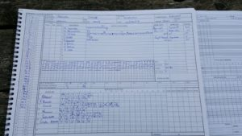
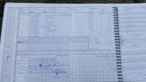

On the warm summers day, Oakley CC won the toss and decided to bat first. G Dique and D Somner opened for Oakley, and started fluently amidst some decent bowling by O Emslie and H Trebert. S Taylor got the first wicket with a D Somner playing onto his stumps for 18. H Trebert soon got the second bowling M Wood for a duck leaving Oakley 49 for 2 off 10 overs. G Dique carried on the scoring alongside A North, then C Morris, before being bowled by N Young for 56, leaving Oakley 129 for 5. Oakley looked to score quickly with B Compton scoring a quick-fire 42, before being bowled by O Emslie. Some lower order hitting helped Oakley reach 226 for 9. N Young finished with 4-50, S Taylor, O Emslie and H Trebert took the rest. Wherwell opened with familiar duo of R Skeates and C Beckingham. T Barnes removed Beckingham early for a duck, leaving Wherwell 5-1 in 4 overs. In came S Taylor, who took the attack to Oakley, with a 33 ball 50, Along with R Skeates, they put on a 110-run partnership, before R Skeates was bowled by Somner for 30. J Foster came in next but was sent back for 5. S Taylor carried on the scoring and quickly reached his hundred, A Gladwyn joined the fun and played some good shots. With the victory in sight, S Taylor on 146 runs, finished it off with a 6 to win Wherwell the game with 8 overs spare. S Taylor played a faultless innings to lead Wherwell to their 4th win in a row. Result leaves Wherwell 5th in the league.

\[caption id="attachment\_18482" align="aligncenter" width="169"\] Wherwell vs Oakley 20170610 Scoresheet\[/caption\]

\[caption id="attachment\_18483" align="aligncenter" width="300"\] Innings of Wherwell\[/caption\]

\[caption id="attachment\_18484" align="aligncenter" width="300"\] Innings of Oakley\[/caption\]
