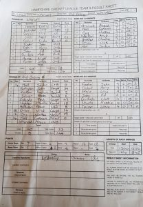

KJM sponsored Wherwell home to Old Basing 2nd XI .

On a windy day, Wherwell lost the toss and were put into bat on a green wicket. The openers played a watchful innings putting on 67 runs for the first wicket. Matt Cutts joined Skipper Robbie Skeates at the fall of the first wicket and both put on a 103 run partnership, until R Skeates was bowled for 57 runs. Oliver Emslie and Matt Cutts put the pressure on Old Basing with some big hitting and helped Wherwell reach 252. Matt Cutts top scored with 94 runs.

In reply Old Basing did not have the best of starts, losing key wickets at quick intervals. Only resistance came from John Huntington scoring 34 and Paul Eckersley scoring 47. Huntington who was sent back by Edwin John, while John Foster returned to remove Eckersley. Old Basing managed to bat out the overs ending on 177 for 8. John Foster topped bowling figures with 3-34.

This result leaves Wherwell 4th the league.

\[caption id="attachment\_18870" align="aligncenter" width="208"\] Wherwell v Old Basing II scoresheet\[/caption\]
