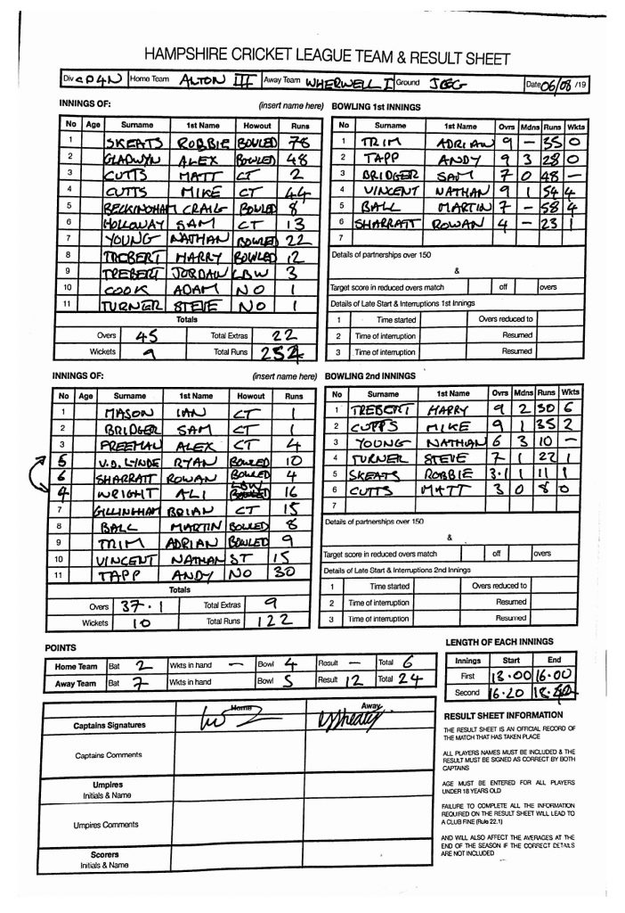

Saturday's game for KJM sponsored Wherwell looked a tough on at fourth placed Alton III’s played hosts.

With vice captain and leading wicket taker Ollie Emslie away, skipper Robbie Skeates finally won a toss and elected to bat.

It was another hot day and the newly formed opening partnership of Skeates and Alex Gladwyn started very strong, with Skeates scoring plenty of boundaries from Alton’s fast bowlers and Gladwyn deciding to score his boundaries from their spinners.

The opening stand was finally broken on 105 when Gladwyn was bowled for 48.

This brought leading run scorer Matt Cutts in, unfortunately it was not to be Cutts' day as he was caught two balls before drinks.

With the score on 152, skipper Skeates was finally removed for 78.

This bought Mike Cutts in and he wasted no time whatsoever in slapping a rapid 44 from 19 balls.

Every batsman who then came in had the freedom to play some shots, Nathan Young chipped in with a well needed 22 to push Wherwell over the line for maximum batting points as they finished on 255-9.

Harry Trebert opened the bowling and took no time in dismantling the Alton’s batting line up.

Both of Alton’s openers were dismissed for one run and then the next three batsmen only added a further 18 before being sent on their way by Trebert and Mike Cutts.

With the home side 20-5 Skeates decided to leave Trebert and he finished with figures of 9-2-30-6.

This was Trebert’s second six wicket haul of the season and with Emslie away it makes the leading wicket taker race very exciting.

Nathan Young had yet another decent day with the ball bowing six overs for 10 runs which included three maidens.

Mike Cutts ended with two wickets, with both Steve Turner and Skeates taking one each.

The day started with some very good fielding with Sam Holloway taking two very simple catches before dropping the easiest chance of all.

Alton’s last pair made Wherwell wait for the win with a last man stand of 45, but they ended a long way from their target all out for 122 .

So a big win for Wherwell against their closest rivals, solidifies third place in the table with some big games coming up.

This Saturday, they will look to keep up their promotion push when they entertain lowly Twyford.

Alton III v Wherwell (away, 06/07/2019) - scoresheet
