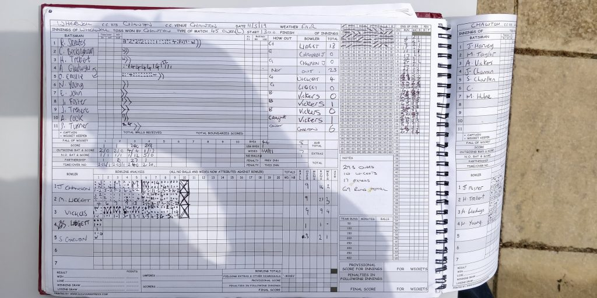
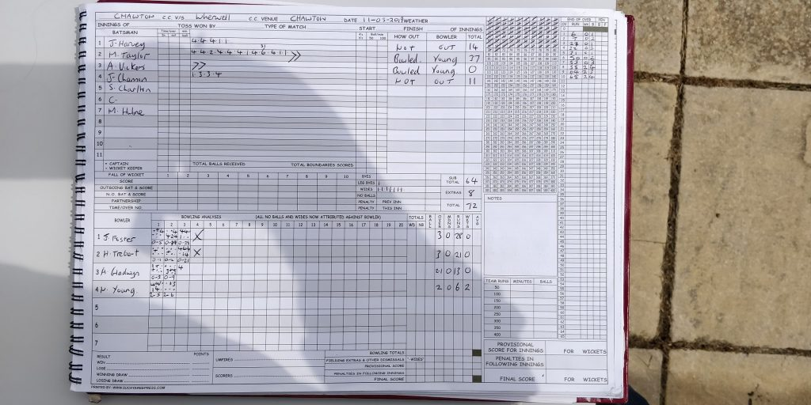

KJM sponsored Wherwell CC travelled to Chawton for the first game of the season. Chawton won the toss and opted to bowl under overcast skies and a green wicket.

Chawton started with 2 wickets in the first over, and ended Wherwell’s innings for 69. Only resistance coming from Alex Gladwyn who top scored with 25 not out.

Chawton chased the runs and finished the game off in 14 overs losing only 2 wickets. The only bright light for Wherwell came from Nathan Young taking 2 wickets in his first 2 balls of his spell.

Chawton v Wherwell (away, 11052019) - Innings of Wherwell

Chawton v Wherwell (away, 11052019) - Innings of Chawton
