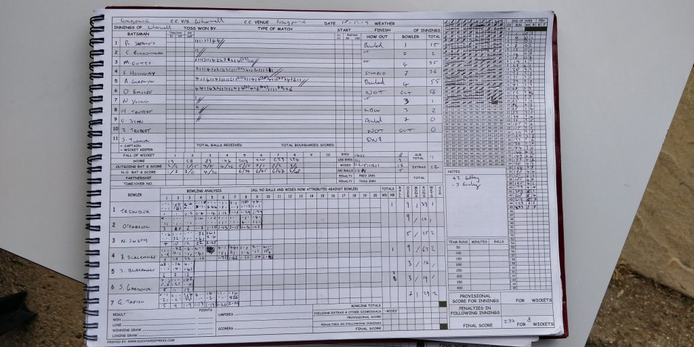
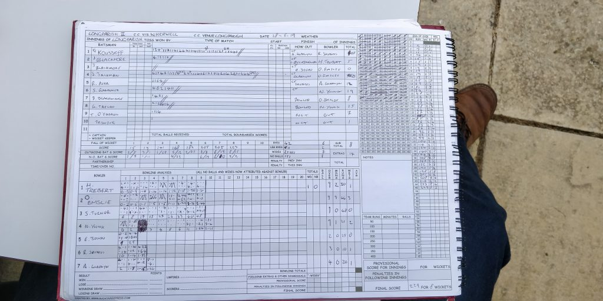

KJM sponsored Wherwell CC travelled to Longparish II. Wherwell won the toss and opted to bowl.

Wherwell started well taking 2 wickets in the first 10 overs for 19 runs. Longparish dug in and rescued their innings to score 229 for 8. J Jackman top scored with 83 and was provided great support by G Kousseff who scored a tough looking 58. O Emslie was impressive with the ball taking 3 wickets for 44 runs. N Young carried on his form from the previous game with 2 for 21, they were backed up well by H Trebert (9o, 30r, 1w), S Turner (9o, 48r, 0w), R Skeates (3o, 10r, 1w) and A Gladwyn (4o, 20r, 1w).

Wherwell started off watchfully but lost both openers in the first 10 overs. M Cutts 35 and S Holloway 36 steadied the ship. A Gladwyn continued his form from the previous game with a well made 55. Longparish hit back Wherwell with quick wickets and squeezed the runs. However the main act came from O Emslie who had been playing like a man on a mission, with 3 required from the last ball of the innings, he smashed the ball into the stands for a 6 to win the game for Wherwell. O Emslie ended on 56 not out. G Taplin was the pick of the bowlers for Longparish with 2 for 29.

Longparish II v Wherwell (away, 19052019) - Innings of Wherwell

Longparish II v Wherwell (away, 19052019) - Innings of Longparish II
