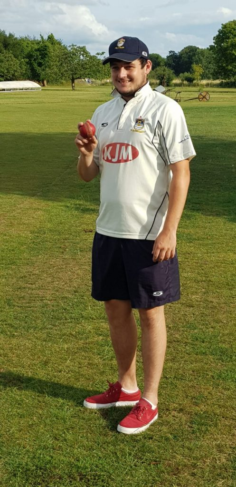
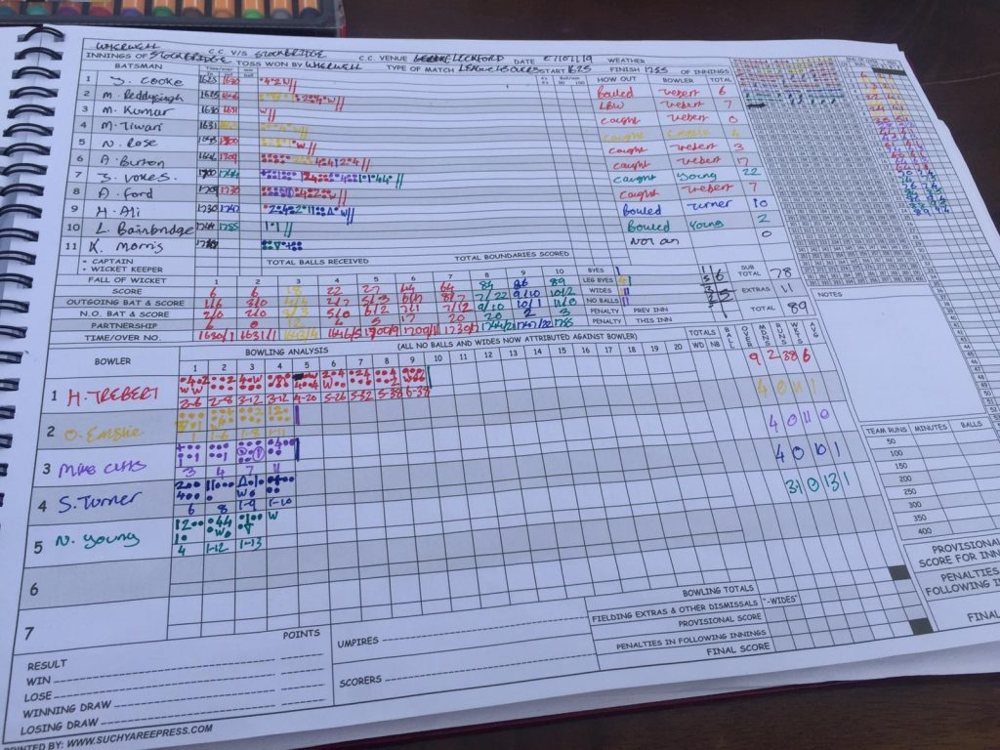

KJM Sponsored Wherwell travelled away to Stockbridge at Leckford. Under overcast skies, Wherwell lost the toss and were put into bat.

Stockbridge started well, sending back both Wherwell openers in quick succession. The innings rebuild fell at the feet of Matt Cutts and Oliver Emslie. They set about their jobs smartly putting away any bad balls they faced to the boundary and constantly rotating the strike. Matt Cutts bought up his 50 with a square drive. He was sent back soon after, ending on 60 runs. They put on a 93 run partnership. Mike Cutts came into bat at 5 and played the innings of the day, scoring powerful 68 not out at a strike rate of 200. This included reaching his half century with a monstrous 6. Oliver Emslie playing the anchor role reached his 5th 50 of the season. Emslie was caught out for 56 runs. Nathan Young looking for quick runs showcased his powerful hitting before being stumped for 19 runs in 8 balls. Wherwell ended the innings for 241-6. Vokes was the pick of the bowlers 9 o 4m 20runs 2 wickets.

Having heard that 280 was the par score, Wherwell knew they had to be at their best in the field to win. But this turned out to be another day to remember for Harry Trebert, who took his 3rd 6 wicket haul of the season. H Trebert started off strongly taking 2 wickets in the first over of the Stockbridge innings. Bowling strong channels, H Trebert kept troubling the batsman who were unable to face his menacing spell. He ended on 6 for 38. Special mention to O Emslie who took a flying one handed catch at point for Harry Trebet’s 5th wicket to remove J Vokes who was looking dangerous. Wherwell finished off the innings for 89 runs in 25 overs. Only resistance coming from A Burton 22 and J Vokes 17. Nathan Young took 2 wickets and the other 2 were shared by Oliver Emslie and Steve Turner.

This result leaves Wherwell 2nd in the league. Wherwell are at home to Rowledge this weekend.

Stockbridge v Wherwell (away, 27/07/2019) - H Trebert 9o 38r 6w

Stockbridge v Wherwell (away, 27/07/2019) - innings of Wherwell

Stockbridge v Wherwell (away, 27/07/2019) - innings of Stockbridge

Stockbridge v Wherwell (away, 27/07/2019)
