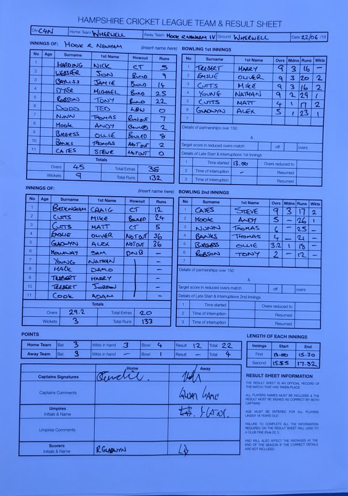

KJM sponsored Wherwell at home to Hook & Newnham Basics IV’s. Wherwell won the toss and elected to bowl.

Wherwell started superbly, keeping the run rate down and taking wickets constantly. This display limited the visitors to 132-9 in 45 overs. Only resistance coming from Michael Dyer 25 runs and Tony Robson 22 runs. Oliver Emslie, Mike Cutts and Matt Cutts took 2 wickets each.

Wherwell in reply chased the target of 132 down in 29.3 overs ending on 133-2. Mike Cutts started off strong with 18 runs in the first 4 balls he faced with 4,4,6,4. However It didn’t last long as he was removed soon after for 24 runs. O Emslie and A Gladwyn carried on their good form with the bat and took Wherwell home with 36 runs each.

Wherwell are away to Littleton & WH next week. This result leaves Wherwell 4th in the league.

Wherwell v Hook & Newnham Basics IV (home, 22/06/2019) - scoresheet
