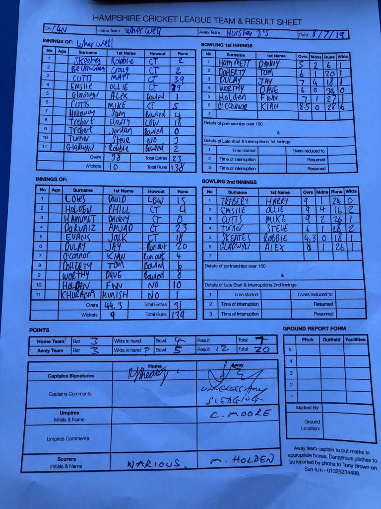

KJM sponsored Wherwell at home to Hursley III. Hursley park won the toss and put Wherwell in to bat.

Wherwell started badly, losing both openers for single digit scores. Matt Cutts and Oliver Emslie consolidated the innings scoring 39 runs each. Harry Trebert with 18 provided vital runs to help wherwell to 138 runs. Kian O’Connor produced a great spell of bowling and took 6 wickets for 28 runs.

A close finish to the game was in store. Wherwell bowled well taking wickets at regular intervals. However Hursley Park reached the target with 3 balls to spare and 1 wicket remaining. Amjad Deruaiz top scored with 23 runs. J Dulay provided support with 20 runs. Oliver Emslie remains a bright spot for Wherwell with 2-16 in 9 overs. Steve Turner also took 2 wickets for 28 runs.

Wherwell are away at Hollybourbe next weekend.

Wherwell v Hursley Park III (home, 08/06/2019) - Scoresheet
