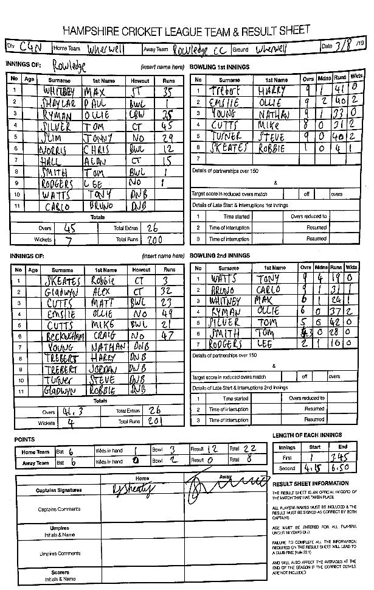

Wherwell make it 7 wins in a row!

KJM Sponsored Wherwell were at home to Rowledge CC. Rowledge won the toss and elected to bat on a flat track.

Wherwell initially started well as Oliver Emslie bowled the opener Paul Shaylar for 1. Rowledge took the attack to Wherwell scoring over 6 runs an over at the end of the 10th over with the loss of only one wicket. Mike Cutts and Steve Turner took quick wickets to restrict the run rate and slow the scoring. Removing Max Whitley and Ollie Rayman for 35 runs each. Wherwell bowling tight lines and taking wickets at regular interval restricted Rowledge to 200-7 in 45 overs. O Emslie, Mike Cutts and S turner took 2 wickets each. Skipper Robbie Skeates bowled 1 over and taking the wicket of a well set Tom Silver who was on 45 runs.

In reply Wherwell lost a quick wicket with captain R Skeates being caught for 3 runs. Alex Gladwyn and Matt Cutts were going well, until Matt Cutts was bowled for 23. Wherwell’s Mr dependable Oliver Emslie came in next and played the anchor role. Rowledge then removed A Gladwyn for a well made 32. Mike Cutts came in next and took the attack to Rowledge scoring a quick 21, before being bowled. Craig Beckingham rolled back the years to score a powerful 47 not out and took Wherwell home with O Emslie 49 not out. Wherwell reached the target in 41 overs, ending on 201-4. Ollie Rayman was the pick of the bowlers for Rowledge with 2 wickets.

This result keeps Wherwell 2nd in the league. Wherwell are away to 3rd placed Compton and Chandlers Ford CC next weekend.

Wherwell v Rowledge (home, 03/08/2019) - scoresheet
