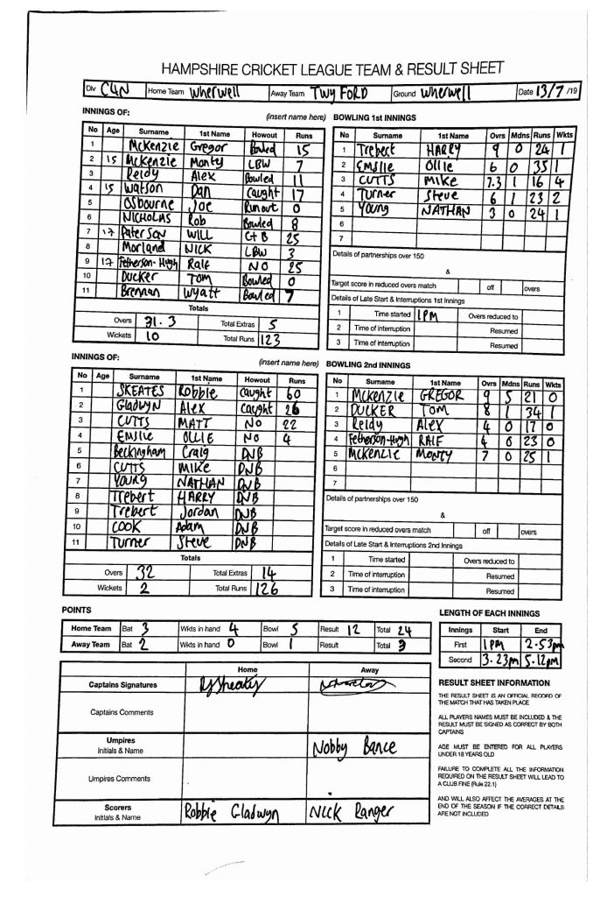

KJM sponsored Wherwell CC won the loss for just the second time this season and opted to field first.

Twyford openers G & M McKenzie both showed promising intent early on but Wherwell replied with a convincing bowling attack toppling nearly their entire line up restricting their innings to just 31.3 overs.

All bowlers took a slice of the pie with tremendous effort on a rock solid pitch making it difficult for all batsmen of the day. H Trebert 9o 24r 1w, O Emslie 6o 35r 1w, N Young 3o 24r 1w and S Turner 6o 23r 2w. Jug avoidance for the local ringer Mike Cutts 7.3o 16 r 4w, fines are due.

Wherwell opened with R Skeates and A Gladwyn. Both built a solid partnership enjoying their time in the middle although was throttled by majestic bowling on the glamerous Wherwell pitch.

R Skeates was caught for 60 putting him second in Wherwell's most runs scored so far, just 30 behind current leader Matt Cutts. A Gladwyn was caught for 26 and securing his top spot in the Wherwell's batting averages so far.

Matt Cutts (22\*) and O Emlsie (4\*) wasted no time with a quick fire partnership to see the victory home. Cricket was the winner. This puts Wherwell second on the table and promotion is edging closer with just six matches left.

No game for Wherwell next week. Next game for Wherwell is away to Stockbridge 27/07 who are third in the table.

Wherwell v Twyford (home, 13/07/2019) - scoresheet
